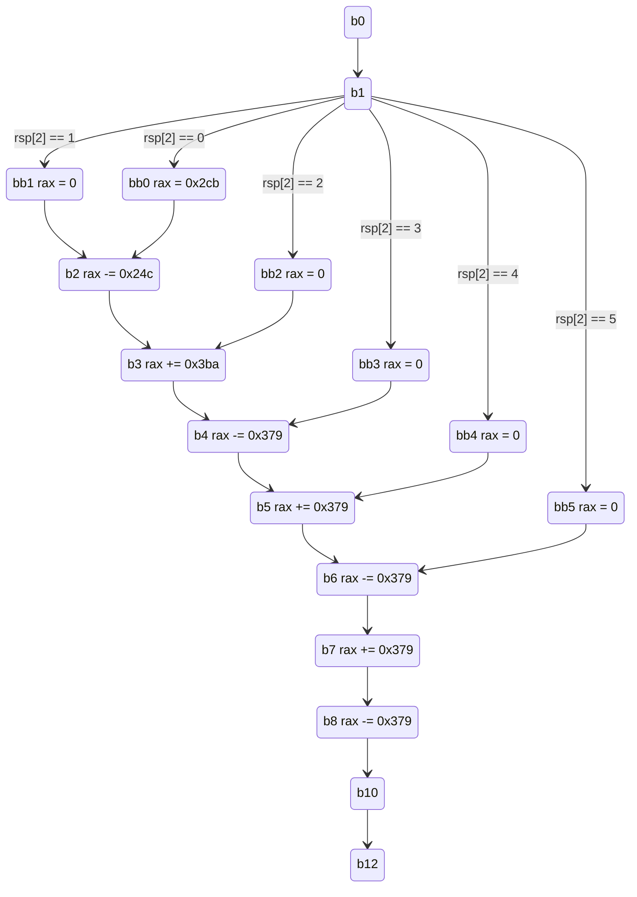

---
category:
  - Course Work
tag:
  - Bomb Lab
  - Computer Organization and Architecture
title: "Bomb Lab: Phase 3"
typora-root-url: ../../../../.vuepress/public
---

## Assembly

```assembly
00000000004014b1 <phase_3>:
b0:
  4014b1:	48 83 ec 18          	sub    $0x18,%rsp
  4014b5:	48 8d 4c 24 0c       	lea    0xc(%rsp),%rcx
  4014ba:	48 8d 54 24 08       	lea    0x8(%rsp),%rdx
  4014bf:	48 8d 35 6f 1f 00 00 	lea    0x1f6f(%rip),%rsi        # 403435 <array.3354+0x255>
  4014c6:	b8 00 00 00 00       	mov    $0x0,%eax
  4014cb:	e8 60 fc ff ff       	callq  401130 <__isoc99_sscanf@plt>
  4014d0:	83 f8 01             	cmp    $0x1,%eax
  4014d3:	7f 05                	jg     4014da <phase_3+0x29>
  4014d5:	e8 82 06 00 00       	callq  401b5c <explode_bomb>
b1:
  4014da:	83 7c 24 08 07       	cmpl   $0x7,0x8(%rsp)
  4014df:	77 6f                	ja     401550 <phase_3+0x9f>
  4014e1:	8b 54 24 08          	mov    0x8(%rsp),%edx
  4014e5:	48 8d 05 d4 1c 00 00 	lea    0x1cd4(%rip),%rax        # 4031c0 <_IO_stdin_used+0x1c0>
  4014ec:	48 63 14 90          	movslq (%rax,%rdx,4),%rdx
  4014f0:	48 01 d0             	add    %rdx,%rax
  4014f3:	ff e0                	jmpq   *%rax
  4014f5:	b8 00 00 00 00       	mov    $0x0,%eax
  4014fa:	eb 05                	jmp    401501 <phase_3+0x50>
  4014fc:	b8 cb 02 00 00       	mov    $0x2cb,%eax
b2:
  401501:	2d 4c 02 00 00       	sub    $0x24c,%eax
  401506:	eb 05                	jmp    40150d <phase_3+0x5c>
  401508:	b8 00 00 00 00       	mov    $0x0,%eax
b3:
  40150d:	05 ba 03 00 00       	add    $0x3ba,%eax
  401512:	eb 05                	jmp    401519 <phase_3+0x68>
  401514:	b8 00 00 00 00       	mov    $0x0,%eax
b4:
  401519:	2d 79 03 00 00       	sub    $0x379,%eax
  40151e:	eb 05                	jmp    401525 <phase_3+0x74>
  401520:	b8 00 00 00 00       	mov    $0x0,%eax
b5:
  401525:	05 79 03 00 00       	add    $0x379,%eax
  40152a:	eb 05                	jmp    401531 <phase_3+0x80>
  40152c:	b8 00 00 00 00       	mov    $0x0,%eax
b6:
  401531:	2d 79 03 00 00       	sub    $0x379,%eax
  401536:	eb 05                	jmp    40153d <phase_3+0x8c>
  401538:	b8 00 00 00 00       	mov    $0x0,%eax
b7:
  40153d:	05 79 03 00 00       	add    $0x379,%eax
  401542:	eb 05                	jmp    401549 <phase_3+0x98>
  401544:	b8 00 00 00 00       	mov    $0x0,%eax
b8:
  401549:	2d 79 03 00 00       	sub    $0x379,%eax
  40154e:	eb 0a                	jmp    40155a <phase_3+0xa9>
b9:
  401550:	e8 07 06 00 00       	callq  401b5c <explode_bomb>
  401555:	b8 00 00 00 00       	mov    $0x0,%eax
b10:
  40155a:	83 7c 24 08 05       	cmpl   $0x5,0x8(%rsp)
  40155f:	7f 06                	jg     401567 <phase_3+0xb6>
  401561:	3b 44 24 0c          	cmp    0xc(%rsp),%eax
  401565:	74 05                	je     40156c <phase_3+0xbb>
b11:
  401567:	e8 f0 05 00 00       	callq  401b5c <explode_bomb>
b12:
  40156c:	48 83 c4 18          	add    $0x18,%rsp
  401570:	c3                   	retq
```

## 翻译为 C

```c
void phase_3(char* rdi) {
b0:
  int rsp[6];
  int* rcx = rsp + 3;
  int* rdx = rsp + 2;
  char* rsi = 0x403435;  // 403435 <array.3354+0x255>
  int rax = 0;           // 32-bit
  rax = __isoc99_sscanf(rdi, rsi, rdx, rcx);
  if (rax > 1)  // 32-bit
    goto b1;
  explode_bomb();
b1:
  if (rsp[2] > 7) goto b9;
  int rdx = rsp[2];     // 32-bit
  int* rax = 0x4031c0;  // 4031c0 <_IO_stdin_used+0x1c0>
  rdx = rax[rdx];
  rax += rdx;
  jmpq(rax);
  rax = 0;  // 32-bit
  goto b2;
  rax = 0x2cb;  // 32-bit
b2:
  rax -= 0x24c;  // 32-bit
  goto b3;
  rax = 0;  // 32-bit
b3:
  rax += 0x3ba;  // 32-bit
  goto b4;
  rax = 0;  // 32-bit
b4:
  rax -= 0x379;  // 32-bit
  goto b5;
  rax = 0;  // 32-bit
b5:
  rax += 0x379;  // 32-bit
  goto b6;
  rax = 0;  // 32-bit
b6:
  rax -= 0x379;  // 32-bit
  goto b7;
  rax = 0;  // 32-bit
b7:
  rax += 0x379;  // 32-bit
  goto b8;
  rax = 0;  // 32-bit
b8:
  rax -= 0x379;  // 32-bit
  goto b10;
b9:
  explode_bomb();
  rax = 0;  // 32-bit
b10:
  if (rsp[2] > 5) goto b11;
  if (rax == rsp[3])  // 32-bit
    goto b12;
b11:
  explode_bomb();
b12:
  return;
}
```

## Hack

```
(gdb) x/s 0x403435
0x403435:       "%d %d"
(gdb) x/8xw 0x4031c0
0x4031c0:       0xffffe33c      0xffffe335      0xffffe348      0xffffe354
0x4031d0:       0xffffe360      0xffffe36c      0xffffe378      0xffffe384
```

| `i` | `*(0x4031c0 + i * sizeof(int))` | `0x4031c0 + *(0x4031c0 + i * sizeof(int))` | BasicBlock |
| --- | ------------------------------- | ------------------------------------------ | ---------- |
| `0` | `0xffffe33c`                    | `0x004014fc`                               | `bb0`      |
| `1` | `0xffffe335`                    | `0x004014f5`                               | `bb1`      |
| `2` | `0xffffe348`                    | `0x00401508`                               | `bb2`      |
| `3` | `0xffffe354`                    | `0x00401514`                               | `bb3`      |
| `4` | `0xffffe360`                    | `0x00401520`                               | `bb4`      |
| `5` | `0xffffe36c`                    | `0x0040152c`                               | `bb5`      |
| `6` | `0xffffe378`                    | `0x00401538`                               | `bb6`      |
| `7` | `0xffffe384`                    | `0x00401544`                               | `bb7`      |

## 重新分割 `BasicBlock`

```assembly
00000000004014b1 <phase_3>:
b0:
  4014b1:	48 83 ec 18          	sub    $0x18,%rsp
  4014b5:	48 8d 4c 24 0c       	lea    0xc(%rsp),%rcx
  4014ba:	48 8d 54 24 08       	lea    0x8(%rsp),%rdx
  4014bf:	48 8d 35 6f 1f 00 00 	lea    0x1f6f(%rip),%rsi        # 403435 <array.3354+0x255>
  4014c6:	b8 00 00 00 00       	mov    $0x0,%eax
  4014cb:	e8 60 fc ff ff       	callq  401130 <__isoc99_sscanf@plt>
  4014d0:	83 f8 01             	cmp    $0x1,%eax
  4014d3:	7f 05                	jg     4014da <phase_3+0x29>
  4014d5:	e8 82 06 00 00       	callq  401b5c <explode_bomb>
b1:
  4014da:	83 7c 24 08 07       	cmpl   $0x7,0x8(%rsp)
  4014df:	77 6f                	ja     401550 <phase_3+0x9f>
  4014e1:	8b 54 24 08          	mov    0x8(%rsp),%edx
  4014e5:	48 8d 05 d4 1c 00 00 	lea    0x1cd4(%rip),%rax        # 4031c0 <_IO_stdin_used+0x1c0>
  4014ec:	48 63 14 90          	movslq (%rax,%rdx,4),%rdx
  4014f0:	48 01 d0             	add    %rdx,%rax
  4014f3:	ff e0                	jmpq   *%rax
bb1:
  4014f5:	b8 00 00 00 00       	mov    $0x0,%eax
  4014fa:	eb 05                	jmp    401501 <phase_3+0x50>
bb0:
  4014fc:	b8 cb 02 00 00       	mov    $0x2cb,%eax
b2:
  401501:	2d 4c 02 00 00       	sub    $0x24c,%eax
  401506:	eb 05                	jmp    40150d <phase_3+0x5c>
bb2:
  401508:	b8 00 00 00 00       	mov    $0x0,%eax
b3:
  40150d:	05 ba 03 00 00       	add    $0x3ba,%eax
  401512:	eb 05                	jmp    401519 <phase_3+0x68>
bb3:
  401514:	b8 00 00 00 00       	mov    $0x0,%eax
b4:
  401519:	2d 79 03 00 00       	sub    $0x379,%eax
  40151e:	eb 05                	jmp    401525 <phase_3+0x74>
bb4:
  401520:	b8 00 00 00 00       	mov    $0x0,%eax
b5:
  401525:	05 79 03 00 00       	add    $0x379,%eax
  40152a:	eb 05                	jmp    401531 <phase_3+0x80>
bb5:
  40152c:	b8 00 00 00 00       	mov    $0x0,%eax
b6:
  401531:	2d 79 03 00 00       	sub    $0x379,%eax
  401536:	eb 05                	jmp    40153d <phase_3+0x8c>
bb6:
  401538:	b8 00 00 00 00       	mov    $0x0,%eax
b7:
  40153d:	05 79 03 00 00       	add    $0x379,%eax
  401542:	eb 05                	jmp    401549 <phase_3+0x98>
bb7:
  401544:	b8 00 00 00 00       	mov    $0x0,%eax
b8:
  401549:	2d 79 03 00 00       	sub    $0x379,%eax
  40154e:	eb 0a                	jmp    40155a <phase_3+0xa9>
b9:
  401550:	e8 07 06 00 00       	callq  401b5c <explode_bomb>
  401555:	b8 00 00 00 00       	mov    $0x0,%eax
b10:
  40155a:	83 7c 24 08 05       	cmpl   $0x5,0x8(%rsp)
  40155f:	7f 06                	jg     401567 <phase_3+0xb6>
  401561:	3b 44 24 0c          	cmp    0xc(%rsp),%eax
  401565:	74 05                	je     40156c <phase_3+0xbb>
b11:
  401567:	e8 f0 05 00 00       	callq  401b5c <explode_bomb>
b12:
  40156c:	48 83 c4 18          	add    $0x18,%rsp
  401570:	c3                   	retq
```

## 重新翻译为 C

```c
void phase_3(char* rdi) {
b0:
  int rsp[6];
  int rax = 0; // 32-bit
  rax = __isoc99_sscanf(rdi, "%d %d", rsp + 2, rsp + 3);
  if (rax > 1)  // 32-bit
    goto b1;
  explode_bomb();
b1:
  if (rsp[2] > 7) goto b9;
  int rdx = rsp[2];     // 32-bit
  int* rax = 0x4031c0;  // 4031c0 <_IO_stdin_used+0x1c0>
  rdx = rax[rdx];
  rax += rdx;
  jmpq(rax);
bb1:
  rax = 0;  // 32-bit
  goto b2;
bb0:
  rax = 0x2cb;  // 32-bit
b2:
  rax -= 0x24c;  // 32-bit
  goto b3;
bb2:
  rax = 0;  // 32-bit
b3:
  rax += 0x3ba;  // 32-bit
  goto b4;
bb3:
  rax = 0;  // 32-bit
b4:
  rax -= 0x379;  // 32-bit
  goto b5;
bb4:
  rax = 0;  // 32-bit
b5:
  rax += 0x379;  // 32-bit
  goto b6;
bb5:
  rax = 0;  // 32-bit
b6:
  rax -= 0x379;  // 32-bit
  goto b7;
bb6:
  rax = 0;  // 32-bit
b7:
  rax += 0x379;  // 32-bit
  goto b8;
bb7:
  rax = 0;  // 32-bit
b8:
  rax -= 0x379;  // 32-bit
  goto b10;
b9:
  explode_bomb();
  rax = 0;  // 32-bit
b10:
  if (rsp[2] > 5) goto b11;
  if (rax == rsp[3])  // 32-bit
    goto b12;
b11:
  explode_bomb();
b12:
  return;
}
```

## Reverse analysis

逆向推导. 整个函数只有一处 `return` 位于 `b12` 中, 因此必须寻找到一条不会引发 `explode_bomb()` 的路径. 由于 `b11` 必然触发 `explode_bomb()`, 因此不能经过 `b11`, 而应通过 `jmp` 绕过 `b11` 到达 `b12`. 可通过 `jmp` 到达 `b12` 的 `BasicBlock` 有且仅有 `b10`, 且必须满足 `(rsp[2] <= 5) && (rax == rsp[3])`. 这意味着, 只有 `bb0`, `bb1`, `bb2`, `bb3`, `bb4`, `bb5` 是可以通过 `jmpq *%rax` 安全到达.

## 删去无效的跳转点翻译为 C

```c
void phase_3(char* rdi) {
b0:
  int rsp[6];
  int rax = 0;  // 32-bit
  rax = __isoc99_sscanf(rdi, "%d %d", rsp + 2, rsp + 3);
  if (rax > 1)  // 32-bit
    goto b1;
  explode_bomb();
b1:
  if (rsp[2] > 7) goto b9;
  int rdx = rsp[2];     // 32-bit
  int* rax = 0x4031c0;  // 4031c0 <_IO_stdin_used+0x1c0>
  rdx = rax[rdx];
  rax += rdx;
  jmpq(rax);
bb1:
  rax = 0;  // 32-bit
  goto b2;
bb0:
  rax = 0x2cb;  // 32-bit
b2:
  rax -= 0x24c;  // 32-bit
  goto b3;
bb2:
  rax = 0;  // 32-bit
b3:
  rax += 0x3ba;  // 32-bit
  goto b4;
bb3:
  rax = 0;  // 32-bit
b4:
  rax -= 0x379;  // 32-bit
  goto b5;
bb4:
  rax = 0;  // 32-bit
b5:
  rax += 0x379;  // 32-bit
  goto b6;
bb5:
  rax = 0;  // 32-bit
b6:
  rax -= 0x379;  // 32-bit
  goto b7;
  rax = 0;  // 32-bit
b7:
  rax += 0x379;  // 32-bit
  goto b8;
  rax = 0;  // 32-bit
b8:
  rax -= 0x379;  // 32-bit
  goto b10;
b9:
  explode_bomb();
  rax = 0;  // 32-bit
b10:
  if (rsp[2] > 5) goto b11;
  if (rax == rsp[3])  // 32-bit
    goto b12;
b11:
  explode_bomb();
b12:
  return;
}
```

## 跳转图

去除必然触发 `explode_bomb` 的 `BasicBlock`, 可得如下跳转图:



## Solution

稍加分析不难发现, 沿着 `b0 --> b1 --> bb4 --> b5 --> b6 --> b7 --> b8 --> b10` 恰好能够得到 `%rax == 0`.

```
4 0
```
