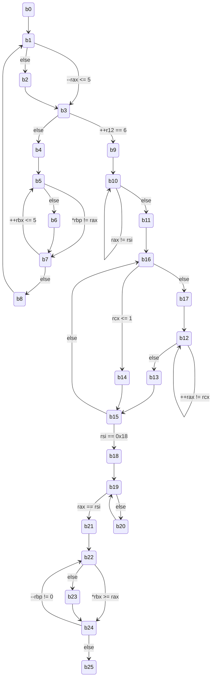

## Assembly

```assembly
0000000000401641 <phase_6>:
b0:
  401641:	41 56                	push   %r14
  401643:	41 55                	push   %r13
  401645:	41 54                	push   %r12
  401647:	55                   	push   %rbp
  401648:	53                   	push   %rbx
  401649:	48 83 ec 50          	sub    $0x50,%rsp
  40164d:	49 89 e5             	mov    %rsp,%r13
  401650:	48 89 e6             	mov    %rsp,%rsi
  401653:	e8 40 05 00 00       	callq  401b98 <read_six_numbers>
  401658:	49 89 e6             	mov    %rsp,%r14
  40165b:	41 bc 00 00 00 00    	mov    $0x0,%r12d
b1:
  401661:	4c 89 ed             	mov    %r13,%rbp
  401664:	41 8b 45 00          	mov    0x0(%r13),%eax
  401668:	83 e8 01             	sub    $0x1,%eax
  40166b:	83 f8 05             	cmp    $0x5,%eax
  40166e:	76 05                	jbe    401675 <phase_6+0x34>
b2:
  401670:	e8 e7 04 00 00       	callq  401b5c <explode_bomb>
b3:
  401675:	41 83 c4 01          	add    $0x1,%r12d
  401679:	41 83 fc 06          	cmp    $0x6,%r12d
  40167d:	74 21                	je     4016a0 <phase_6+0x5f>
b4:
  40167f:	44 89 e3             	mov    %r12d,%ebx
b5:
  401682:	48 63 c3             	movslq %ebx,%rax
  401685:	8b 04 84             	mov    (%rsp,%rax,4),%eax
  401688:	39 45 00             	cmp    %eax,0x0(%rbp)
  40168b:	75 05                	jne    401692 <phase_6+0x51>
b6:
  40168d:	e8 ca 04 00 00       	callq  401b5c <explode_bomb>
b7:
  401692:	83 c3 01             	add    $0x1,%ebx
  401695:	83 fb 05             	cmp    $0x5,%ebx
  401698:	7e e8                	jle    401682 <phase_6+0x41>
b8:
  40169a:	49 83 c5 04          	add    $0x4,%r13
  40169e:	eb c1                	jmp    401661 <phase_6+0x20>
b9:
  4016a0:	48 8d 74 24 18       	lea    0x18(%rsp),%rsi
  4016a5:	4c 89 f0             	mov    %r14,%rax
  4016a8:	b9 07 00 00 00       	mov    $0x7,%ecx
b10:
  4016ad:	89 ca                	mov    %ecx,%edx
  4016af:	2b 10                	sub    (%rax),%edx
  4016b1:	89 10                	mov    %edx,(%rax)
  4016b3:	48 83 c0 04          	add    $0x4,%rax
  4016b7:	48 39 f0             	cmp    %rsi,%rax
  4016ba:	75 f1                	jne    4016ad <phase_6+0x6c>
b11:
  4016bc:	be 00 00 00 00       	mov    $0x0,%esi
  4016c1:	eb 23                	jmp    4016e6 <phase_6+0xa5>
b12:
  4016c3:	48 8b 52 08          	mov    0x8(%rdx),%rdx
  4016c7:	83 c0 01             	add    $0x1,%eax
  4016ca:	39 c8                	cmp    %ecx,%eax
  4016cc:	75 f5                	jne    4016c3 <phase_6+0x82>
b13:
  4016ce:	eb 07                	jmp    4016d7 <phase_6+0x96>
b14:
  4016d0:	48 c7 c2 20 53 40 00 	mov    $0x405320,%rdx
b15:
  4016d7:	48 89 54 74 20       	mov    %rdx,0x20(%rsp,%rsi,2)
  4016dc:	48 83 c6 04          	add    $0x4,%rsi
  4016e0:	48 83 fe 18          	cmp    $0x18,%rsi
  4016e4:	74 16                	je     4016fc <phase_6+0xbb>
b16:
  4016e6:	8b 0c 34             	mov    (%rsp,%rsi,1),%ecx
  4016e9:	83 f9 01             	cmp    $0x1,%ecx
  4016ec:	7e e2                	jle    4016d0 <phase_6+0x8f>
b17:
  4016ee:	b8 01 00 00 00       	mov    $0x1,%eax
  4016f3:	48 c7 c2 20 53 40 00 	mov    $0x405320,%rdx
  4016fa:	eb c7                	jmp    4016c3 <phase_6+0x82>
b18:
  4016fc:	48 8b 5c 24 20       	mov    0x20(%rsp),%rbx
  401701:	48 8d 44 24 28       	lea    0x28(%rsp),%rax
  401706:	48 8d 74 24 50       	lea    0x50(%rsp),%rsi
  40170b:	48 89 d9             	mov    %rbx,%rcx
b19:
  40170e:	48 8b 10             	mov    (%rax),%rdx
  401711:	48 89 51 08          	mov    %rdx,0x8(%rcx)
  401715:	48 83 c0 08          	add    $0x8,%rax
  401719:	48 39 f0             	cmp    %rsi,%rax
  40171c:	74 05                	je     401723 <phase_6+0xe2>
b20:
  40171e:	48 89 d1             	mov    %rdx,%rcx
  401721:	eb eb                	jmp    40170e <phase_6+0xcd>
b21:
  401723:	48 c7 42 08 00 00 00 	movq   $0x0,0x8(%rdx)
  40172a:	00
  40172b:	bd 05 00 00 00       	mov    $0x5,%ebp
b22:
  401730:	48 8b 43 08          	mov    0x8(%rbx),%rax
  401734:	8b 00                	mov    (%rax),%eax
  401736:	39 03                	cmp    %eax,(%rbx)
  401738:	7d 05                	jge    40173f <phase_6+0xfe>
b23:
  40173a:	e8 1d 04 00 00       	callq  401b5c <explode_bomb>
b24:
  40173f:	48 8b 5b 08          	mov    0x8(%rbx),%rbx
  401743:	83 ed 01             	sub    $0x1,%ebp
  401746:	75 e8                	jne    401730 <phase_6+0xef>
b25:
  401748:	48 83 c4 50          	add    $0x50,%rsp
  40174c:	5b                   	pop    %rbx
  40174d:	5d                   	pop    %rbp
  40174e:	41 5c                	pop    %r12
  401750:	41 5d                	pop    %r13
  401752:	41 5e                	pop    %r14
  401754:	c3                   	retq
```

## 翻译为 C

```c
void phase_6(char* rdi) {
b0:
  rsp -= 0x50;
  int* r13 = rsp;
  int* rsi = rsp;
  read_six_numbers(rdi, rsi);
  int* r14 = rsp;
  int r12 = 0;
b1:
  int* rbp = r13;
  int rax = *r13;
  if (--rax <= 5) goto b3;
b2:
  explode_bomb();
b3:
  if (++r12 == 6) goto b9;
b4:
  int rbx = r12;
b5:
  rax = rsp[rbx];
  if (*rbp != rax) goto b7;
b6:
  explode_bomb();
b7:
  if (++rbx <= 0x5) goto b5;
b8:
  r13 += 0x4;
  goto b1;
b9:
  rsi = rsp + 0x18;
  rax = r14;
  int rcx = 7;
b10:
  int rdx = rcx;
  rdx -= *rax;
  *rax = rdx;
  rax += 0x4;
  if (rax != rsi) goto b10;
b11:
  int rsi = 0;
  goto b16;
b12:
  rdx = *(rdx + 0x8);
  if (++rax != rcx) goto b12;
b13:
  goto b15;
b14:
  rdx = 0x405320;
b15:
  *(rsp + rsi * 2 + 0x20) = rdx;
  rsi += 0x4;
  if (rsi == 0x18) goto b18;
b16:
  int rcx = *(rsp + rsi * 1);
  if (rcx <= 1) goto b14;
b17:
  int rax = 1;
  rdx = 0x405320;
  goto b12;
b18:
  rbx = *(rsp + 0x20);
  rax = rsp + 0x28;
  rsi = rsp + 0x50;
  rcx = rbx;
b19:
  rdx = *rax;
  *(rcx + 0x8) = rdx;
  rax += 0x8;
  if (rax == rsi) goto b21;
b20:
  rcx = rdx;
  goto b19;
b21:
  *(rdx + 0x8) = 0;
  int rbp = 0x5;
b22:
  rax = *(rbx + 0x8);
  int rax = *rax;   // 32-bit
  if (*rbx >= rax)  // 32-bit
    goto b24;
b23:
  explode_bomb();
b24:
  rbx = *(rbx + 0x8);
  if (--rbp != 0)  // 32-bit
    goto b22;
b25:
  rsp += 0x50;
  return;
}
```

## State Graph



## Optimize

```c
void phase_6(char* rdi) {
  b0;
  while (1) {
    b1;
    if (--rax > 5) b2;
    b3;
    if (++r12 == 6) break;
    b4;
    do {
      b5;
      if (*rbp == rax) b6;
      b7;
    } while (++rbx <= 5);
    b8;
  }
  b9;
  do {
    b10;
  } while (rax != rsi);
  b11;
  do {
    b16;
    if (rcx <= 1) {
      b14;
    } else {
      b17;
      do {
        b12;
      } while (++rax != rcx);
      b13;
    }
    b15;
  } while (rsi != 0x18);
  b18;
  while (1) {
    b19;
    if (rax == rsi) break;
    b20;
  }
  b21;
  do {
    b22;
    if (*rbx < rax) b23;
    b24;
  } while (--rbp != 0);
  b25;
}
```

## Optimize

```c
void phase_6(char* rdi) {
  rsp -= 0x50;
  r13 = rsp;
  rsi = rsp;
  read_six_numbers(rdi, rsi);
  r14 = rsp;
  r12 = 0;
  while (1) {
    rbp = r13;
    rax = r13;
    if (--rax > 5) explode_bomb();
    if (++r12 == 6) break;
    rbx = r12;
    do {
      if (*rbp == rax) explode_bomb();
    } while (++rbx <= 5);
    r13 += 4;
  }
  rsi = rsp + 0x18;
  rax = r14;
  rcx = 7;
  do {
    rdx = rcx;
    rdx -= *rax;
    *rax = rdx;
    rax += 4;
  } while (rax != rsi);
  rsi = 0;
  do {
    rcx = *(rsp + rsi * 1);
    if (rcx <= 1) {
      rdx = 0x405320;
    } else {
      rax = 1;
      rdx = 0x405320;
      do {
        rdx = *(rdx + 8);
      } while (++rax != rcx);
    }
    *(rsp + rsi * 2 + 0x20) = rdx;
    rsi += 4;
  } while (rsi != 0x18);
  rbx = *(rsp + 0x20);
  rax = rsp + 0x28;
  rsi = rsp + 0x50;
  rcx = rbx;
  while (1) {
    rdx = *rax;
    *(rcx + 8) = rdx;
    rax += 8;
    if (rax == rsi) break;
    rcx = rdx;
  }
  *(rdx + 8) = 0;
  rbp = 5;
  do {
    rax = *(rbx + 8);
    rax = *rax;
    if (*rbx < rax) explode_bomb();
    rbx = *(rbx + 8);
  } while (--rbp != 0);
  rsp += 0x50;
}
```

## Hack

```
(gdb) x/16xg 0x405320
0x405320 <node1>:       0x00000001000002f5      0x0000000000000000
0x405330 <node2>:       0x00000002000002c7      0x0000000000405340
0x405340 <node3>:       0x0000000300000374      0x0000000000405350
0x405350 <node4>:       0x000000040000029a      0x0000000000405360
0x405360 <node5>:       0x00000005000002c2      0x0000000000405200
0x405370:       0x0000000000000000      0x0000000000000000
0x405380 <completed.7098>:      0x0000000000000000      0x0000000000000000
0x405390:       0x0000000000000000      0x0000000000000000
(gdb) x/32xw 0x405320
0x405320 <node1>:       0x000002f5      0x00000001      0x00000000      0x00000000
0x405330 <node2>:       0x000002c7      0x00000002      0x00405340      0x00000000
0x405340 <node3>:       0x00000374      0x00000003      0x00405350      0x00000000
0x405350 <node4>:       0x0000029a      0x00000004      0x00405360      0x00000000
0x405360 <node5>:       0x000002c2      0x00000005      0x00405200      0x00000000
0x405370:       0x00000000      0x00000000      0x00000000      0x00000000
0x405380 <completed.7098>:      0x00000000      0x00000000      0x00000000      0x00000000
0x405390:       0x00000000      0x00000000      0x00000000      0x00000000
(gdb) x/4xg 0x405200
0x405200 <node6>:       0x00000006000000a1      0x0000000000000000
0x405210 <user_password>:       0x64496d4a50745575      0x4c75456b5a5a4744
(gdb) x/8xw 0x405200
0x405200 <node6>:       0x000000a1      0x00000006      0x00405320      0x00000000
0x405210 <user_password>:       0x50745575      0x64496d4a      0x5a5a4744      0x4c75456b
```

| Address            | a       | b   | next                         |
| ------------------ | ------- | --- | ---------------------------- |
| `0x405320 <node1>` | `0x2f5` | `1` | `0x0000000000405330 <node2>` |
| `0x405330 <node2>` | `0x2c7` | `2` | `0x0000000000405340 <node3>` |
| `0x405340 <node3>` | `0x374` | `3` | `0x0000000000405350 <node4>` |
| `0x405350 <node4>` | `0x29a` | `4` | `0x0000000000405360 <node5>` |
| `0x405360 <node5>` | `0x2c2` | `5` | `0x0000000000405200 <node6>` |
| `0x405200 <node6>` | `0x0a1` | `0` | `0x0000000000000000 <NULL>`  |

## Optimize

```c
struct Node {
  int a, b;
  struct Node* next;
};

void phase_6(char* rdi) {
  int rsp[6];            // rsp + 0x00 -- rsp + 0x18
  struct Node* rsp1[6];  // rsp + 0x20 -- rsp + 0x50
  read_six_numbers(rdi, rsp);
  for (int r12 = 0; r12 != 6; ++r12) {
    if (rsp[r12] - 1 > 5) explode_bomb();
    for (int rbx = r12; rbx <= 5; ++rbx) {
      if (rsp[r12] == rsp[rbx]) explode_bomb();
    }
  }
  for (int* rax = rsp; rax != rsp + 6; ++rax) *rax = 7 - *rax;
  for (int rsi = 0; rsi != 6; ++rsi) {
    struct Node* rdx = 0x405320;
    for (int rax = 1; rax < rsp[rsi]; ++rax) rdx = rdx->next;
    rsp1[rsi] = rdx;
  }
  struct Node* rcx = rsp1[0];
  for (struct Node** rax = rsp1; rax != rsp1 + 6; ++rax) {
    rcx->next = *rax;
    rcx = *rax;
  }
  rsp1[5]->next = 0;
  struct Node* rbx = rsp1[0];
  for (int rbp = 5; rbp != 0; --rbp) {
    if (rbx->a < rbx->next->a) explode_bomb();
    rbx = rbx->next;
  }
}
```

## Analysis

从地址中可以分析出, `phase_6` 使用到了结构体, 猜想其结构如 `struct Node` 所示, 表示链表.

```c
  read_six_numbers(rdi, rsp);
```

不难发现, `phase_6` 需要输入 6 个 `int`, 记为 `rsp[i]`.

```c
  for (int r12 = 0; r12 != 6; ++r12) {
    if (rsp[r12] - 1 > 5) explode_bomb();
    for (int rbx = r12; rbx <= 5; ++rbx) {
      if (rsp[r12] == rsp[rbx]) explode_bomb();
    }
  }
```

检查输入的 6 个数均 `< 7`, 且不重复.

```c
  for (int* rax = rsp; rax != rsp + 6; ++rax) *rax = 7 - *rax;
```

将输入的 6 个数用 `7` 减去, 得到新的 6 个数 `rsp[i] = 7 - rsp[i]`.

```c
  for (int rsi = 0; rsi != 6; ++rsi) {
    struct Node* rdx = 0x405320;
    for (int rax = 1; rax < rsp[rsi]; ++rax) rdx = rdx->next;
    rsp1[rsi] = rdx;
  }
```

将链表的第 `rsp[i]` 个结点的指针存入 `rsp1` 内.

```c
  struct Node* rcx = rsp1[0];
  for (struct Node** rax = rsp1; rax != rsp1 + 6; ++rax) {
    rcx->next = *rax;
    rcx = *rax;
  }
  rsp1[5]->next = 0;
```

对链表进行重排序, 按照 `rsp[i]` 指定的顺序排序.

```c
  int rbp = 5;
  for (struct Node* rbx = rsp1[0]; rbp != 0; --rbp) {
    if (rbx->a < rbx->next->a) explode_bomb();
    rbx = rbx->next;
  }
```

检查排序后的链表是否满足非升序.

## Solution

基于前文 Hack 中得到的数据, 我们可以给出初始时列表元素的值为

```
[0x2f5, 0x2c7, 0x374, 0x29a, 0x2c2, 0x0a1]
```

为保证列表按非升序排列, 正确的排列为

```
3 1 2 5 4 6
```

又因为过程中进行了 `rsp[i] = 7 - rsp[i]` 的变换, 因此正确的输入为

```
4 6 5 2 3 1
```
