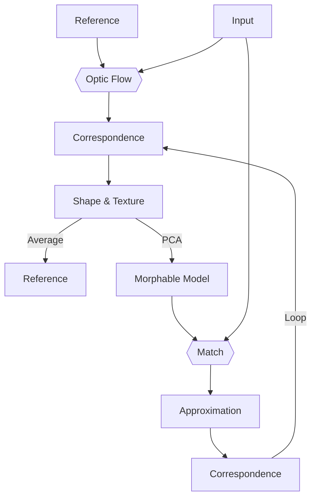

---
category:
  - Reading Notes
  - Research
tag:
  - Face Model
title: A Morphable Model For The Synthesis Of 3D Faces
typora-root-url: ../../../.vuepress/public
---

[[PDF] acm.org](https://dl.acm.org/doi/pdf/10.1145/311535.311556)

## TL;DR

- focus on **identity**
- **Morphable Model** --- averages of shape $\bar{S}$ and texture $\bar{T}$ + eigenvectors $s_i$ and $t_i$
- **Formula** --- $S_{mod} = \bar{S} + \sum_{i = 1}^{m - 1} \alpha_i s_i$
- **Building**

  - **Input** --- 3D Scans
  - **Method** --- Optic Flow + PCA ( see [Sec. 5](#_5-building-a-morphable-model) )

- **Matching / Register** --- minimize difference between images / 3D scans

## Abstract

- new face images / new 3D face models <-- dense one-to-one **correspondence to internal face model**
- derive **morphable face model** by transforming **shape & texture** into **vector space representation**
- **3D face reconstructions** from single images

## 1. Introduction

Human knowledge is critical for **computer aided face modeling** & **separation of natural faces from non faces**.

## 3. Morphable 3D Face Model

geometry of a face:

$$
\begin{align*}
  S & = (X_1, Y_1, Z_1, X_2, \dots, Y_n, Z_n)^T \in \mathfrak{R}^{3 n} \qc &
    & \qq{$X, Y, Z$ coordinates of its $n$ vertices}                         \\
  T & = (R_1, G_1, B_1, R_2, \dots, G_n, B_n)^T \in \mathfrak{R}^{3 n} \qc &
    & \qq{$R, G, B$ color values}
\end{align*}
$$

new shapes $S_{mod}$ & new textures $T_{mod}$:

$$
\vb{S}_{mod} = \sum_{i = 1}^m a_i \vb{S}_i \qc
\vb{T}_{mod} = \sum_{i = 1}^m b_i \vb{T}_i \qc
\sum_{i = 1}^m a_i = \sum_{i = 1}^m b_i = 1
$$

**morphable model**: set of faces $\pqty{S_{mod}\pqty{\vec{a}}, T_{mod}\pqty{\vec{b}}}$, parameterized by coefficients $\vec{a} = (a_1, a_2, \dots, a_m)^T$ & $\vec{b} = (b_1, b_2, \dots, b_m)^T$

example set of faces --> **probability distribution for coefficients $a_i$ & $b_i$** --> regulates likelihood of appearance of generated faces

**data compression**: PCA --> **orthogonal coordinate system** formed by eigenvectors $s_i$ & $t_i$ of covariance matrices

- $\overline{S}, \overline{T}$ --- averages of shape & texture
- $C_S, C_T$ --- covariance matrices computed over shape & texture differences $\Delta{S_i} = S_i - \overline{S}$, $\Delta{T_i} = T_i - \overline{T}$
- $\sigma_i^2$ --- eigenvalues of shape covariance matrix $C_S$

$$
S_{mod} = \overline{S} + \sum_{i = 1}^{m - 1} \alpha_i s_i \qc
T_{mod} = \overline{T} + \sum_{i = 1}^{m - 1} \beta_i t_i \qc
\vec{\alpha}, \vec{\beta} \in \mathfrak{R}^{m - 1}
$$

$$
\qq{propability for coefficients}
p\pqty{\vec{\alpha}} \sim \exp\bqty{- \frac{1}{2} \sum_{i = 1}^{m - 1} \pqty{\alpha_i / \sigma_i}^2}
$$

##### Segmented morphable model

subdivide vector space of faces into independent subspaces

### 3.1. Facial attributes

manually assign labels $\mu_i$ describing markedness of the attribute --> **weighted sums**:

$$
\Delta{S} = \sum_{i = 1}^m \mu_i \pqty{S_i - \overline{S}} \qc
\Delta{T} = \sum_{i = 1}^m \mu_i \pqty{T_i - \overline{T}}
$$

> Multiples of $\pqty{\Delta{S}, \Delta{T}}$ can now be added to or subtracted from any individual face. For binary attributes, such as gender, we assign constant values $\mu_A$ for all $m_A$ faces in class $A$, and $\mu_B \neq \mu_A$ for all $m_B$ faces in $B$. Affecting only the scaling of $\Delta{S}$ and $\Delta{T}$, the choice of $\mu_A, \mu_B$ is arbitary.

## 4. Matching a morphable model to images

##### Model Parameters

- $\alpha_j$ --- facial shape
- $\beta_j$ --- texture
- $\vec{\rho}$ --- rendering = camera position + object scale + ...

colored images:

$$
\vb{I}_{mod}\pqty{x, y} = \pqty{I_{r, mod}\pqty{x, y}, I_{g, mod}\pqty{x, y}, I_{b, mod}\pqty{x, y}}^T
$$

Euclidean distance:

$$
E_I = \sum_{x, y} \norm{\vb{I}_{input}\pqty{x, y} - \vb{I}_{mod}\pqty{x, y}}^2
$$

restrict by a tradeoff between matching quality and prior probabilities

For Gaussian noise with a standard deviation $\sigma_N$, the likelihood to observe $I_{input}$ is $p\pqty{\vb{I}_{input} \vert \vec{\alpha}, \vec{\beta}, \vec{\rho}} \sim \exp\bqty{\frac{-1}{2 \sigma_N^2} \vdot E_I}$

cost function:

$$
E
= \frac{1}{\sigma_N^2} E_I
  + \sum_{j = 1}^{m - 1} \frac{\alpha_j^2}{\sigma_{S, j}^2}
  + \sum_{j = 1}^{m - 1} \frac{\beta_j^2}{\sigma_{T, j}^2}
  + \sum_j \frac{\pqty{\rho_j - \overline{\rho}_j}^2}{\sigma_{\rho, j}^2}
$$

Phong illumination:

$$
I_{r, mod, k}
= \pqty{i_{r, amb} + i_{r, dir} \vdot \pqty{\vb{n}_k \vb{l}}} \bar{R}_k
  + i_{r, dir} s \vdot \pqty{\vb{r}_k \vb{v}_k}^{\nu}
$$

- $k$ --- triangle
- $\vb{l}$ --- direction of illumination
- $\vb{v}_k$ --- normalized difference of camera position and position of triangle's center
- $\vb{r}_k = 2 \pqty{\vb{n} \vb{l}} \vb{n} - \vb{l}$ --- direction of reflected ray
- $s$ --- surface shininess
- $\nu$ --- angular distribution of specular reflection

$$
E_I \approx \sum_{k = 1}^{n_t} a_k \vdot \norm{\vb{I}_{input}\pqty{\bar{p}_{x, k}, \bar{p}_{y, k}} - \vb{I}_{mod, k}}^2
$$

- $a_k$ --- image area covered by triangle $k$

$$
E_{\mathcal{K}} = \sum_{k \in \mathcal{K}} \norm{\vb{I}_{input}\pqty{\bar{p}_{x, k}, \bar{p}_{y, k}} - \vb{I}_{mod, k}}^2
$$

- $\mathcal{K} \subset \Bqty{1, \dots, n_t}$ --- random subset of 40 triangles $k$

$$
\qq{probability of selecting $k$} p\pqty{k \in \mathcal{K}} \sim a_k
$$

##### Coarse-to-Fine

1. First set of iterations is performed with low resolution.
2. In subsequent iterations, more and more principal components are added.
3. Starting with a relatively large $\sigma_N$, we later reduce $\sigma_N$ to obtain maximum matching quality.
4. In the last iterations, the face model is broken down into segments. With parameters $\rho_j$ fixed, coefficients $\alpha_j$ and $\beta_j$ are optimized independently for each segment. This increased number of degrees of freedom significantly improves facial details.

##### Multiple Images

- a separate set of $\rho_j$ for each input image
- $E_I$ is replaced by a sum of image distances for each pair of input and model images

##### Illumination-Corrected Texture Extraction

> Subsequent to matching, we compare the prediction $\vb{I}_{mod, i}$ for each vertex $i$ with $\vb{I}_{input}\pqty{p_{x, i}, p_{y, i}}$, and compute the change in texture $\pqty{R_i, G_i, B_i}$ that accounts for the difference.

### 4.1. Matching a morphable model to 3D scans

a scan can be represented as

$$
\vb{I}\pqty{h, \phi} = \pqty{R\pqty{h, \phi}, G\pqty{h, \phi}, B\pqty{h, \phi}, r\pqty{h, \phi}}^T
$$

In a face $\pqty{S, T}$, defined by shape and texture coefficients $\alpha_j$ and $\beta_j$, vertex $i$ with texture values $\pqty{R_i, G_i, B_i}$ and cylindrical coordinates $\pqty{r_i, h_i, \phi_i}$ is mapped to $\vb{I}_{mod}\pqty{h_i, \phi_i} = \pqty{R_i, G_i, B_i, r_i}^T$. The matching algorithm from the previous section now determines $\alpha_i$ and $\beta_j$ minimizing

$$
E = \sum_{h, \phi} \norm{\vb{I}_{input}\pqty{h, \phi} - \vb{I}_{mod}\pqty{h, \phi}}^2
$$

## 5. Building a morphable model

### 5.1. 3D correspondence using Optic Flow

- The algorithm computes a flow field $\pqty{\delta{h}\pqty{h, \phi}, \delta{\phi}\pqty{h, \phi}}$ that minimizes differences of $\norm{\vb{I}_1\pqty{h, \phi} - \vb{I}_2\pqty{h + \delta{h}, \phi + \delta{\phi}}}$.
- Given a definition of shape and texture vectors $S_{ref}$ and $T_{ref}$ for the reference face, $S$ and $T$ for each face in the database can be obtained by means of the point-to-point correspondence provided by $\pqty{\delta{h}\pqty{h, \phi}, \delta{\phi}\pqty{h, \phi}}$.

### 5.2. Bootstrapping the model

> **The basic recursive step:** Suppose that an existing morphable model is not powerful enough to match a new face and thereby find correspondence with it. The idea is first to find rough correspondences to the novel face using the (inadequate) morphable model and then improve these correspondences by using an optic flow algorithm.

