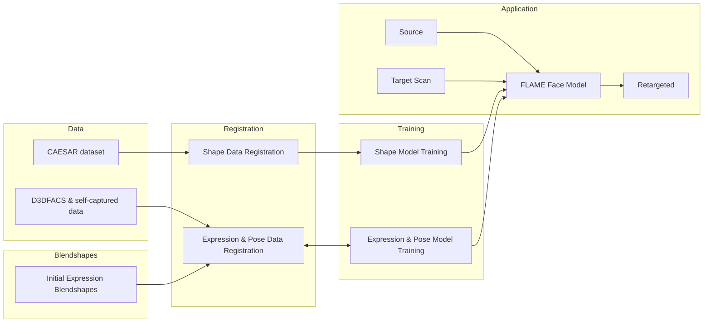

---
category:
  - Reading Notes
  - Research
tag:
  - Face Model
title: Learning a model of facial shape and expression from 4D scans
typora-root-url: ../../../.vuepress/public
---

- [[PDF] games-cn.org](https://slides.games-cn.org/pdf/GAMES201727李天野.pdf)

## 3. Model formulation

FLAME is described by a function:

$$
M\pqty{\vec{\beta}, \vec{\theta}, \vec{\psi}}: \mathbb{R}^{\abs{\vec{\beta}} \times \abs{\vec{\theta}} \times \abs{\vec{\psi}}} \to \mathbb{R}^{3 N}
$$

- $\vec{\beta}$ --- coefficients describing shape
- $\vec{\theta}$ --- coefficients describing pose
- $\vec{\psi}$ --- coefficients describing expression
- $\overline{\vb{T}} \in \mathbb{R}^{3 N}$ --- template mesh in the "zero pose" $\vec{\theta}^*$
- $\vec{\theta}^*$ --- "zero pose"
- $B_S\pqty{\vec{\beta}; \mathcal{S}}: \mathbb{R}^{\abs{\vec{\beta}}} \to \mathbb{R}^{3 N}$ --- shape blendshape function to account for identity related shape variation
- $B_P\pqty{\vec{\theta}; \mathcal{P}}: \mathbb{R}^{\abs{\vec{\theta}}} \to \mathbb{R}^{3 N}$ --- corrective pose blendshapes to correct pose deformations that cannot be explained solely by LBS
- $B_E\pqty{\vec{\psi}; \mathcal{E}}: \mathbb{R}^{\abs{\vec{\psi}}} \to \mathbb{R}^{3 N}$ --- expression blendshapes that capture facial expressions
- $W\pqty{\overline{\vb{T}}, \vb{J}, \vec{\theta}, \mathcal{W}}$ --- A standard skinning function is applied to rotate the vertices of $\overline{\vb{T}}$ around joints $\vb{J} \in \mathbb{R}^{3 K}$, linearly smoothed by blendweights $\mathcal{W} \in \mathbb{R}^{K \times N}$

$$
\begin{equation}
  M\pqty{\vec{\beta}, \vec{\theta}, \vec{\psi}} = W\pqty{T_P\pqty{\vec{\beta}, \vec{\theta}, \vec{\psi}}, \vb{J}\pqty{\vec{\beta}}, \vec{\theta}, \mathcal{W}}
  \label{eq:1}
\end{equation}
$$

$$
T_P\pqty{\vec{\beta}, \vec{\theta}, \vec{\psi}} = \overline{\vb{T}} + B_S\pqty{\vec{\beta}; \mathcal{S}} + B_P\pqty{\vec{\theta}; \mathcal{P}} + B_E\pqty{\vec{\psi}; \mathcal{E}}
$$

$$
\vb{J}\pqty{\vec{\beta}; \mathscr{T}, \overline{\vb{T}}, \mathcal{S}} = \mathscr{T}\pqty{\overline{\vb{T}} + B_S\pqty{\vec{\beta}; \mathcal{S}}}
$$

- $\mathscr{T}$ --- a sparse matrix defining how to compute joint locations from mesh vertices

#### Shape blendshapes

$$
B_S\pqty{\vec{\beta}; \mathcal{S}} = \sum_{n = 1}^{\abs{\vec{\beta}}} \beta_n \vb{S}_n
$$

- $\vec{\beta} = \bqty{\beta_1, \dots, \beta_{\abs{\vec{\beta}}}}^T$ --- shape coefficients
- $\mathcal{S} = \bqty{\vb{S}_1, \dots, \vb{S}_{\vec{\beta}}} \in \mathbb{R}^{3 N \times \abs{\vec{\beta}}}$ --- orthonormal shape basis, which will be learned below with PCA

#### Pose blendshapes

$$
B_P\pqty{\vec{\theta}; \mathcal{P}} = \sum_{n = 1}^{9 K} \pqty{R_n\pqty{\vec{\theta}} - R_n\pqty{\vec{\theta}^*}} \vb{P}_n
$$

- $R\pqty{\vec{\theta}}: \mathbb{R}^{\abs{\vec{\theta}}} \to \mathbb{R}^{9 K}$ --- a function from a face / head / eye pose vector $\vec{\theta}$ to a vector containing the concatenated elements of all the corresponding rotation matrices
- $R_n\pqty{\vec{\theta}}, R_n\pqty{\vec{\theta}^*}$ --- $n$-th element of $R\pqty{\vec{\theta}}$ and $R\pqty{\vec{\theta}^*}$
- vector $\vb{P}_n \in \mathbb{R}^{3 N}$ --- vertex offsets from the rest pose activated by $R_n$
- $\mathcal{P} = \bqty{\vb{P}_1, \dots, \vb{P}_{9 K}} \in \mathbb{R}^{3 N \times 9 K}$ --- pose space, a matrix containing all pose blendshapes

#### Expression blendshapes

$$
\begin{equation}
  B_E\pqty{\vec{\psi}; \mathcal{E}} = \sum_{n = 1}^{\abs{\vec{\psi}}} \vec{\psi}_n \vb{E}_n
  \label{eq:5}
\end{equation}
$$

- $\vec{\psi} = \bqty{\psi_1, \dots, \psi_{\abs{\vec{\psi}}}}^T$ --- expression coefficients
- $\mathcal{E} = \bqty{\vb{E}_1, \dots, \vb{E}_{\abs{\vec{\psi}}}} \in \mathbb{R}^{3 N \times \abs{\vec{\psi}}}$ --- orthonormal expression basis

#### Template shape

## 4. Temporal registration

### 4.1. Initial model

#### Shape

#### Pose

#### Expression

### 4.2. Single-frame registration

#### Model-only

estimate the model coefficients $\Bqty{\vec{\beta}, \vec{\theta}, \vec{\psi}}$ by optimizing

$$
E\pqty{\vec{\beta}, \vec{\theta}, \vec{\psi}} = E_D + \lambda_L E_L + E_P
$$

$$
E_D = \lambda_D \sum_{\vb{v}_s} \rho \pqty{\min_{\vb{v}_m \in M\pqty{\vec{\beta}, \vec{\theta}, \vec{\psi}}} \norm{\vb{v}_s - \vb{v}_m}}
$$

- $E_D$ --- measures the scan-to-mesh distance of the scan vertices $\vb{v}_s$ and the closest point in the surface of the model
- $\vb{v}_s$ --- scan vertices
- $\lambda_D$ --- weight controls the influence of the data term
- $\rho$ --- a Geman-McClure robust penalty function
- $E_L$ --- a landmark term, measuring the L2-norm distance between image landmarks and corresponding vertices on the model template, projected into the image using the known camera calibration

$$
E_P = \lambda_{\vec{\theta}} E_{\vec{\theta}} + \lambda_{\vec{\beta}} E_{\vec{\beta}} + \lambda_{\vec{\psi}} E_{\vec{\psi}}
$$

- $E_P$ --- regularizes the pose coefficients $\vec{\theta}$, shape coefficients $\vec{\beta}$, and expression coefficients $\vec{\psi}$ to be close to zero by penalizing their squared values

#### Coupled

allow the optimization to leave the model space by optimizing

$$
\begin{equation}
  E\pqty{\vb{T}, \vec{\beta}, \vec{\theta}, \vec{\psi}} = E_D + E_C + E_R + E_P
  \label{eq:9}
\end{equation}
$$

- $\vb{T}$ --- template mesh

- $E_D$ --- measures the scan-to-mesh distance from the scan to the aligned mesh $\vb{T}$

- $E_C$ --- constrains $\vb{T}$ to be close to the current statistical model by penalizing edge differences between $\vb{T}$ and the model $M\pqty{\vec{\beta}, \vec{\theta}, \vec{\psi}}$ as

  $$
  E_C = \sum_e \lambda_e \norm{\vb{T}_e - M\pqty{\vec{\beta}, \vec{\theta}, \vec{\psi}}_e}
  $$

- $\vb{T}_e, M\pqty{\vec{\beta}, \vec{\theta}, \vec{\psi}}_e$ --- edges of $\vb{T}$ and $M\pqty{\vec{\beta}, \vec{\theta}, \vec{\psi}}$
- $\lambda_e$ --- an individual weight assigned to each edge

$$
E_R = \frac{1}{N} \sum_{k = 1}^N \lambda_k \norm{U\pqty{\vb{v}_k}}^2
$$

- $E_R$ --- regularization term for each vertex $\vb{v}_k \in \mathbb{R}^3$ in $\vb{T}$
- $U\pqty{\vb{v}} = \frac{\sum_{\vb{v}_r \in \mathcal{N}\pqty{\vb{v}}} \vb{v}_r - \vb{v}}{\abs{\mathcal{N}\pqty{\vb{v}}}}$
- $\mathcal{N}\pqty{\vb{v}}$ --- the set of vertices in the one-ring neighborhood of $\vb{v}$

#### Texture-based

$$
E\pqty{\vb{T}, \vec{\beta}, \vec{\theta}, \vec{\psi}} = E_D + E_C + \lambda_T E_T + E_R + E_P
$$

- $E_T$ --- measures the **photometric error** between real image $I$ and the rendered textured image $\hat{I}$ of $\vb{T}$ from all $V$ views

$$
E_T = \sum_{l = 0}^3 \sum_{v = 1}^V \norm{\Gamma\pqty{I_l^{\pqty{v}}} - \Gamma\pqty{\hat{I}_l^{\pqty{v}}}}_F^2
$$

- $\norm{\vb{X}}_F$ --- Frobenius norm of $\vb{X}$
- $\Gamma$ --- ratio of Gaussian filters help minimize the influence of lighting changes between real and rendered images
- $I_l^{\pqty{v}}$ --- the image $I$ of resolution level $l$ from view $v$

### 4.3. Sequential registration

#### Personalization

- use a coupled registration ( Equation $\eqref{eq:9}$ ) and average the results $\vb{T}_i$ across multiple sequences to get a personalized template for each subject
- randomly select one of the $\vb{T}$ for each subject to generate a personalized texture map

#### Sequence fitting

- replace the generic model template $\overline{\vb{T}}$ in $M$ $\eqref{eq:1}$ by personalized template
- fix the $\vec{\beta}$ to zero
- initialize the model parameters from the previous frame and use the single-frame registration 4.2.

## 6. Model training

**decouple** shape, pose, and expression variations

- $\Bqty{\mathcal{P}, \mathcal{W}, \mathcal{T}}$ --- pose parameters
- $\mathcal{E}$ --- expression parameters
- $\Bqty{\overline{\vb{T}}, \mathcal{S}}$ --- shape parameters

### 6.1. Pose parameter training

- $\vb{T}_i^P$ --- personalized rest-pose templates
- $\vb{J}_i^P$ --- person specific joints
- $\mathcal{W}$ --- blendweights
- $\mathcal{P}$ --- pose blendshapes
- $\mathcal{T}$ --- joint regressor

alternate between:

- solve for the pose parameters $\vec{\theta}_j$ of each registration $j$
- optimize the subject specific parameters $\Bqty{\vb{T}_i^P, \vb{J}_i^P}$
- optimize the global parameters $\Bqty{\mathcal{W}, \mathcal{P}, \mathcal{T}}$

objective function being optimized consists of:

- data term $E_D$ --- penalizes the squared Euclidean reconstruction error of the training data
- regularization term $E_{\mathcal{P}}$ --- penalizes the Frobenius norm of the pose blendshapes
- regularization term $E_{\mathcal{W}}$ --- penalizes large deviations of the blendweights from their initialization

> To avoid $\vb{T}_i^P$ and $\vb{J}_i^P$ being affected by strong facial expressions, expression effects are removed when solving for $\vb{T}_i^P$ and $\vb{J}_i^P$. This is done by jointly solving for pose $\vec{\theta}$ and expression parameters $\vec{\psi}$ for each registration, subtracting $B_E$ (Equation $\eqref{eq:5}$), and solving for $\vb{T}_i^P$ and $\vb{J}_i^P$ on those residuals.

### 6.2. Expression parameter training

- solve for the pose parameters $\vec{\theta}_j$ of each registration
- **unpose**: remove the pose influence by applying the inverse transformation entailed by $M\pqty{\vec{0}, \vec{\theta}, \vec{0}}$ (Equation $\eqref{eq:1}$)
- $\vb{V}_j^U$ --- the vertices resulting from unposing the registration $j$
- $\vb{V}_i^{NE}$ --- the vertices of the neutral expression of subject $i$, also unposed
- compute expression residuals $\vb{V}_j^U - \vb{V}_{s\pqty{j}}^{N E}$ for each registration $j$
- $s\pqty{j}$ --- the subject index $j$
- compute expression space $\mathcal{E}$ by applying PCA

### 6.3. Shape parameter training

- $\overline{\vb{T}}$ --- computed as the mean of these expression- and pose-normalized registrations
- $\mathcal{S}$ --- formed by the first $\vec{\beta}$ principal components computed using PCA

### 6.4. Optimization structure

Due to the high capacity and flexibility of the expression space formulation, **pose blendshapes** should be trained **before** **expression parameters** in order to avoid expression overfitting.
