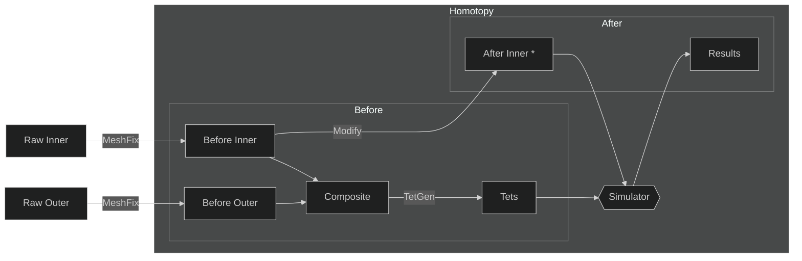

---
category:
  - Group Meeting
  - Research
layout: Slide
tag:
  - Computer Graphics
  - Physics
title: 组会 2023-08-23
typora-root-url: ../../../.vuepress/public
---

@slidestart

## Introduction

- **Data Collection:** pre- & post- surgery CT of individuals
- **Target**
  - **Input:** pre-surgery CT + surgical details (post-surgery skeleton)
  - **Output:** post-surgery face

---

## Demo

- Bunny
- Template Head

--

### Bunny

  
  
  <video width="32%" height="24%" autoplay controls loop muted>
    <source src="/img/2023/2023-08-23T151048Z.mp4" />
  </video>

--

### Template Head

  
  
  <video width="32%" height="24%" autoplay controls loop muted>
    <source src="/img/2023/2023-08-23T154651Z.mp4" />
  </video>

---

## Pipeline

--

---

## 现存问题

- 上半骨骼较复杂, [`MeshFix`](https://pymeshfix.pyvista.org) 后 `TetGen` 仍检测到 self-intersection

---

## TODO

- [ ] 计算 loss \& 判断收敛
- [ ] 测试不同的内骨骼形变
- [ ] 处理上半骨骼
- [ ] 调参

@slideend
